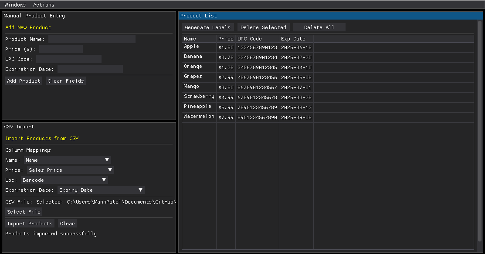
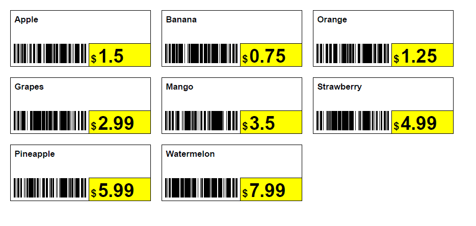

# Label Maker App  

## Overview  
Label Maker is a simple yet powerful tool designed to help users generate labels from CSV files and export them as PDFs.  
  
The generated labels.  
 

## 🚀 Currently Implemented Features  
- **QR Code & Barcode Support**: Auto-generate barcodes from CSV data and onto the label.  
- **Generate Labels and Export as PDF**: Generate 1" by 2" labels for gondola shelving and save labels in a high-quality PDF format.  
  - **Multi-Page PDF Support**: Handle large datasets more efficiently.  
- **Import CSV File**: Quickly import large CSV files for fast label generation.  
- **Add Labels Manually**: Input labels one by one if needed.  
- **Table View of Products Before Label Generation**:  
  - Delete a single row of a product.  
  - Delete all rows without restarting the application.  

## 🔥 Upcoming Features  
- **Customizable Labels**: Adjust label size, font, and layout.  
- **Drag & Drop CSV Upload**: Simplify file selection.  
- **Edit a Row Instead of Deleting & Re-adding**: Improve workflow efficiency.  
- **Smart Mapping Recognition**: Automatically detect and map columns correctly.  

## 📥 Download  
🔗 [Download **`Helios Label Maker.exe`**](Helios%20Label%20Maker.exe) to get started!  

## Contributing  
Feel free to submit issues or contribute to the project!  
